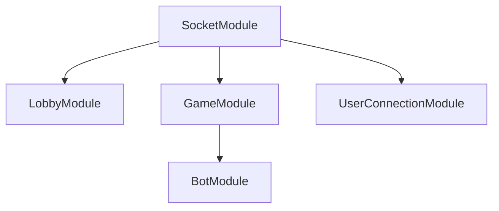

# 소켓 모듈 구조 리팩토링 설계서

## 1. 목표
- 소켓/게임 서버의 관심사 분리 및 순환 의존성 해소
- 유지보수성과 확장성 향상
- 각 도메인별(로비, 게임, 유저, 봇) 독립적 개발/테스트 가능

---

## 2. 제안 구조

### 2.1. 모듈 구성

- **LobbyModule**: 대기실/로비 관리 (방 생성, 입장, 퇴장, 방 옵션 등)
- **GameModule**: 게임 진행, 턴 관리, 플레이어 상태, 아이템, 채팅 등 (게임 내 로직)
- **BotModule**: 게임 내 봇 AI/트리거/행동 (GameModule 하위)
- **UserConnectionModule**: 유저 접속/연결/상태 관리
- **SocketModule**: 위 모듈들을 통합, Gateway(소켓 서버)만 위치


### 2.2. 의존성/관계

- SocketModule → LobbyModule, GameModule, UserConnectionModule
- GameModule → BotModule (BotModule은 GameModule 하위)
- 각 모듈은 필요한 서비스만 exports/imports
- 순환 의존 필요한 경우에만 forwardRef 사용



---

## 3. 각 모듈 역할

### LobbyModule
- 방 생성/삭제/입장/퇴장/옵션 관리
- 게임 시작 전까지의 모든 로비 관련 기능

### GameModule
- 게임 진행, 턴 관리, 플레이어 상태, 아이템, 채팅, 게임 내 이벤트 등
- BotModule을 하위로 import

### BotModule
- 봇 생성/AI/행동/트리거 등 봇 관련 로직만 담당
- GameModule에서만 import

### UserConnectionModule
- 유저의 소켓 연결/해제, 재접속, 상태 추적, 인증 등

### SocketModule
- Gateway(실제 소켓 서버)만 위치
- 각 모듈의 서비스/이벤트를 Gateway에서 DI하여 사용

---

## 4. 장점
- 관심사 분리로 코드/테스트/확장 관리가 쉬움
- 순환 의존 최소화, forwardRef 최소 사용
- 각 도메인별 독립적 개발/테스트 가능
- 새로운 기능(랭킹, 매치메이킹 등)도 별도 모듈로 쉽게 추가 가능

---

## 5. NestJS 코드 예시

```ts
// socket.module.ts
@Module({
  imports: [
    LobbyModule,
    GameModule,
    UserConnectionModule,
  ],
  providers: [SocketGateway],
})
export class SocketModule {}

// game.module.ts
@Module({
  imports: [
    forwardRef(() => BotModule),
    // 기타 게임 관련 모듈
  ],
  providers: [GameService, ...],
  exports: [GameService, ...],
})
export class GameModule {}

// bot.module.ts
@Module({
  imports: [
    // GameModule 필요시 forwardRef로 import
  ],
  providers: [BotService, ...],
  exports: [BotService],
})
export class BotModule {}
```

---

## 6. 추가 팁
- pub/sub, observer 등 이벤트 기반 통신 적극 활용
- 각 모듈의 exports에는 외부에서 꼭 필요한 서비스만 노출
- Gateway(소켓 서버)는 SocketModule에만 두고, 실제 로직은 각 도메인 모듈의 서비스에 위임 